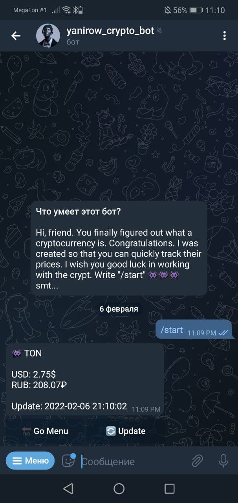
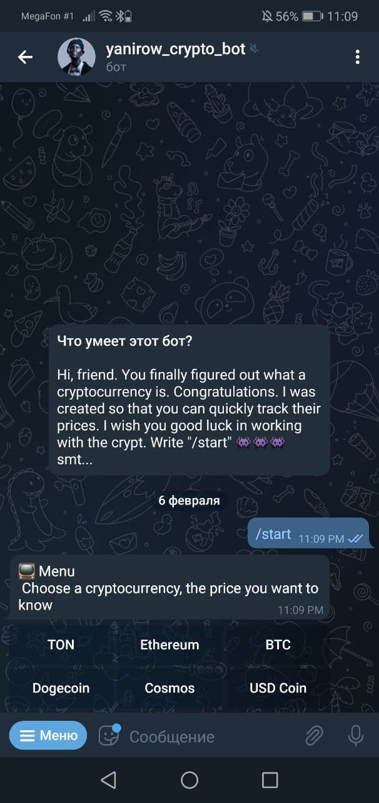

##Cryptocurrency Telegram Bot

>The bot uses only one guzzle library to send requests. Everything else is implemented by hand and php. Basically I use Webhooks.

<tr style="display: flex;">
  <td></td>
  <td></td>
<tr>
 | 

If you want to run this thing on your machine, then copy the repository and install the token in index.php. It is also important to install the bot on a server with the https protocol, this is a requirement of the telegram api. If the bot does not respond, try installing the webhook manually.

>https://api.telegram.org/bot{tocken}/setWebhook?url={link on your server with https}
